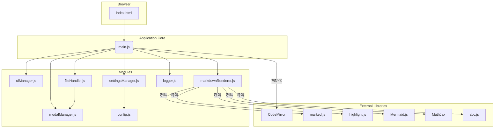
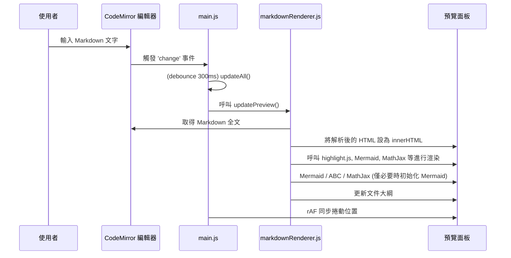
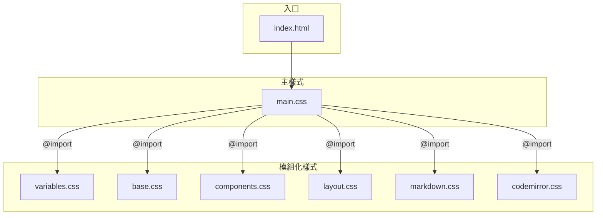
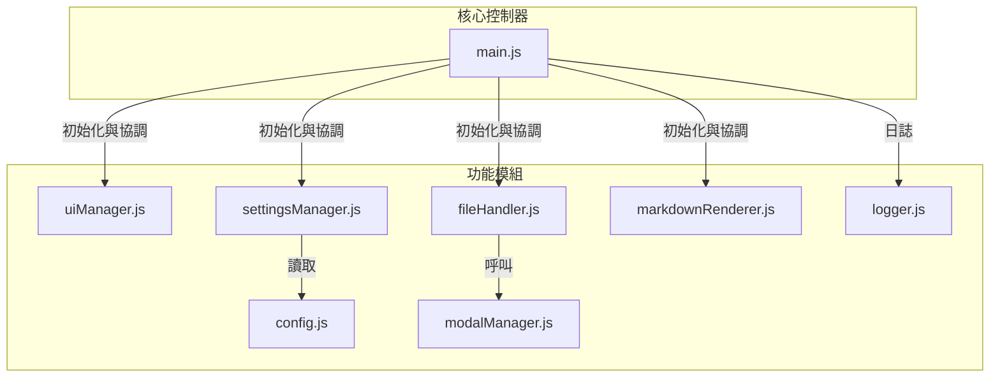

# 專案架構文件

本文件旨在說明 Markdown 編輯器的整體架構、資料流程以及 CSS/JavaScript 的模組化設計。

> 更新紀錄（最近變更摘要）
> - 新增 logger.js 集中日誌層（可用 localStorage 設定 log:level）。
> - main.js 導入 debounce、rAF 滾動同步、Mermaid 主題差異初始化、DOM 快取。
> - modalManager.js 加入 ESC 關閉、focus trap、Tab 循環、焦點還原。
> - settingsModal 新增「套用」按鈕；重設保持開啟即時預覽。
> - fileHandler 上傳邏輯允許同檔再次選擇並整合錯誤日誌。
> - markdownRenderer 改用集中 logger，後續便於差異渲染擴充。

## 1. 整體架構圖

此圖展示了專案的核心組成部分以及它們之間的依賴關係。

**說明**：

-   **`index.html`** 是應用的唯一入口點，負責載入所有必要的 CSS 和 JavaScript 資源。
-   **`main.js`** 是應用的核心控制器，負責初始化所有模組和函式庫，並綁定主要的事件監聽器。
-   **Modules** 是一組遵循「關注點分離」原則的 JavaScript 模組，每個模組都有明確的職責。
-   **External Libraries** 是專案所依賴的第三方函式庫，用於實現 Markdown 解析、語法高亮、圖表渲染等核心功能。

---

## 2. 渲染流程循序圖

此圖詳細說明了從使用者在編輯器中輸入文字到預覽區更新的完整流程。

**說明**：

1.  使用者在 CodeMirror 編輯器中輸入內容。
2.  編輯器觸發 `change` 事件，通知 `main.js` 內容已變更。
3.  `main.js` 呼叫 `updateAll()` 函式，啟動渲染流程。
4.  `updateAll()` 內部呼叫 `markdownRenderer.js` 中的 `updatePreview()` 函式。
5.  `updatePreview()` 負責協調 `marked.js`、`highlight.js`、`Mermaid.js` 等函式庫，完成 Markdown 解析、語法高亮和圖表渲染。
6.  最終，將渲染完成的 HTML 內容更新到預覽面板中，並刷新文件大綱。

---

## 3. CSS 架構

CSS 採用模組化和變數化的方式進行管理，以提高可維護性和主題切換的彈性。

**說明**：

-   **`main.css`** 是唯一的 CSS 入口，負責匯入所有其他樣式檔案。
-   **`variables.css`**：定義了所有顏色、字體等全域 CSS 變數，是實現主題切換的核心。
-   **`base.css`**：設定全域和基礎 HTML 元素的樣式。
-   **`components.css`**：定義可重用的 UI 元件，如按鈕、模態框。
-   **`layout.css`**：負責頁面的宏觀佈局，如分割面板。
-   **`markdown.css`**：專門定義預覽區中 Markdown 內容的樣式。
-   **`codemirror.css`**：專門定義 CodeMirror 編輯器的樣式及主題覆寫。

---

## 4. JavaScript 架構

JavaScript 同樣採用模組化設計，每個模組職責分明，透過 `main.js` 進行協調。

**說明**：

-   **`main.js`**：核心控制器。職責：初始化、綁定核心事件、協調各模組。
-   **`config.js`**：靜態設定檔。職責：存放不會改變的設定，如顏色對應表。
-   **`uiManager.js`**：UI 管理器。職責：處理純粹的 UI 互動，如主題切換、檢視模式、標頭收合。
-   **`fileHandler.js`**：檔案處理器。職責：處理檔案的上傳、下載、匯出 PDF 等。
-   **`settingsManager.js`**：設定管理器。職責：處理設定面板的所有邏輯，包括儲存、讀取和應用設定。
-   **`markdownRenderer.js`**：渲染器。職責：協調 `marked.js` 和其他函式庫，將 Markdown 文本轉換為最終的預覽內容。
-   **`modalManager.js`**：模態框管理器。職責：提供一個統一的 API 來顯示各類型的對話框。
-   **`logger.js`**：集中化日誌，替代散落 console，支援層級控制。

**新增 / 調整說明**：
- logger.js：集中化日誌，替代散落 console，支援層級控制。
- main.js：加入 DOM 快取、debounce、rAF 同步、Mermaid 差異初始化。
- modalManager.js：強化可及性（ESC、焦點循環、焦點還原）。
- settingsManager.js：支持「套用」不關閉、reset 不關閉更易比對顏色結果。

---

## 5. 可及性 (a11y) 強化摘要
- Modal：focus trap、ESC 退出、開關保留焦點位置。
- 後續建議：按鈕 aria-label、role="dialog"、主題切換加上 aria-pressed。

## 6. 日誌策略
- 預設層級 info；localStorage.setItem('log:level','debug') 開啟詳細。
- 可掛鉤 window.onerror / unhandledrejection 統一上報（未實作，可待擴充）。

## 7. 後續建議 (Roadmap)
- Heading 重複 ID 自動去重 (#title, #title-2 ...)。
- 差異渲染 / 虛擬化預覽以支援大型文件。
- 匯出 PDF 客製化分頁控制 (page-break-before: h1)。
- Service Worker / PWA 離線支援 + 本地版本歷史 (IndexedDB)。
- 插件化渲染管線：允許自訂語法前/後處理。
