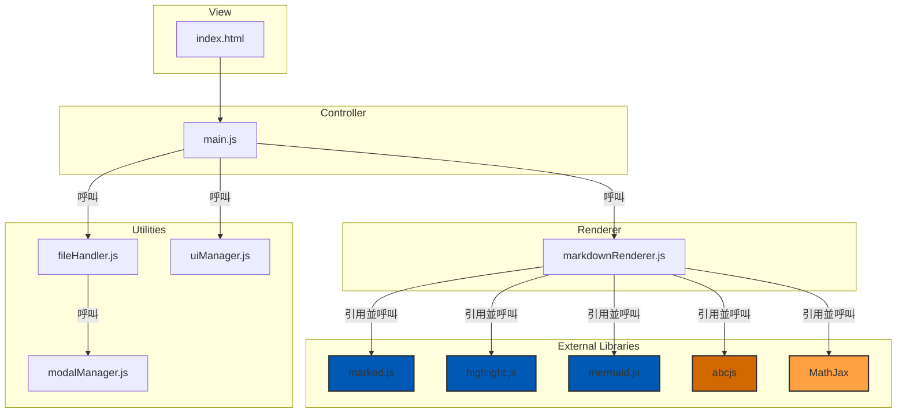
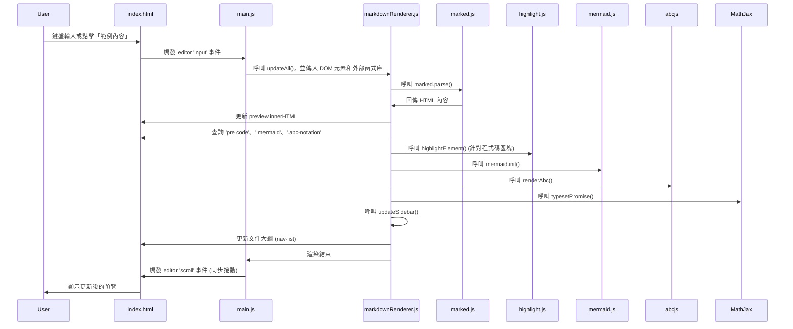
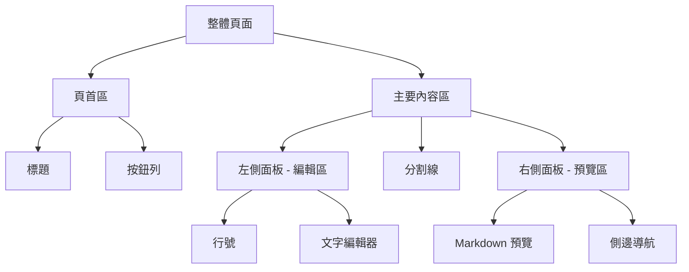
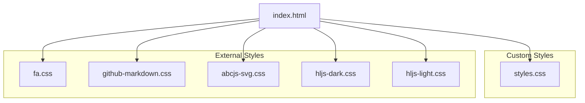
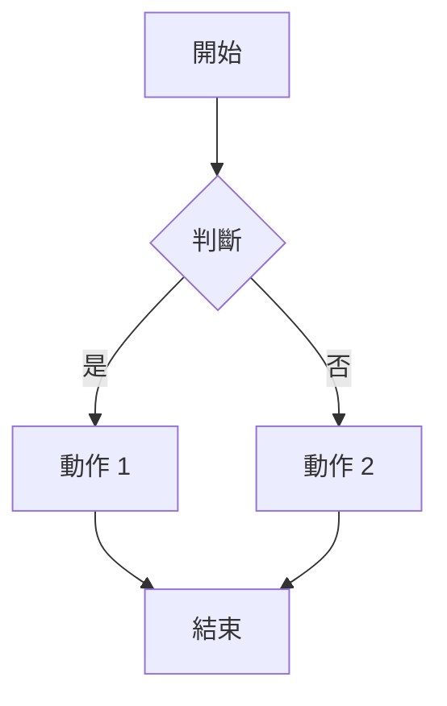

# Markdown 編輯器
## 歡迎使用這款強大的工具
這是一個支援多種進階功能的 Markdown 文件範例。
### 功能介紹
- **即時預覽**: 在右側面板即時顯示渲染結果。
- **程式碼**: 支援多種程式語言。
- **數學公式**: 支援 LaTeX 語法。
- **Mermaid 圖表**: 輕鬆繪製流程圖、序列圖等。
- **樂譜渲染**: 支援 ABC Notation 語法。
- **PDF 匯出**: 一鍵將內容轉換為 PDF。

### 程式碼範例
```javascript
function helloWorld() {
  console.log("Hello, World!");
}
```

### 數學公式
這是著名的質能等價公式： $E = mc^2$

其它數學式:
$$
\int_{0}^{\infty} e^{-x^2} dx = \frac{\sqrt{\pi}}{2}
$$
$$
\\int_{-\\infty}^\\infty e^{-x^2}dx = \\sqrt{\\pi}
$$

\\[
\\cos^2 \\theta + \\sin^2 \\theta = 1
\\]

<div style="page-break-after: always;"></div>
<br><br>

### Mermaid 圖表

 - 系統架構圖 (Architecture Diagram)



 - 循序圖 (Sequence Diagram)


<div style="page-break-after: always;"></div>
<br><br>

 - 版面配置規劃 (Layout Planning)


 - CSS 架構圖 (CSS Architecture Diagram)


<div style="page-break-after: always;"></div>
<br><br>


 - 流程圖範例 



<div style="page-break-after: always;"></div>
<br><br>

### 樂譜範例
```abc
X:1
T:愛爾蘭舞曲 (Drowsy Maggie) - 小調與裝飾音
M:4/4
L:1/8
K:Edor
E2BE dEBE|E2BE AFDF| E2BE dEBE|BABc dAFD:|
d2fd c2ec|defg afge|d2fd c2ec|BABc dAFD|
d2fd c2ec|defg afge|afge fdec|BABc dAFD||
```

```abc
X:1
T:和弦與歌詞範例
M:4/4
L:1/4
K:C
"Ｃ" C E G c | "Ｇ７" G B d f | "Ｆ" F A c' e' | "Ｃ" C E G c2 |
w: 歡-迎-來-到 | ABC-記-譜-法 | 世-界-真-奇-妙 | 音樂-真-美-妙-！
```
