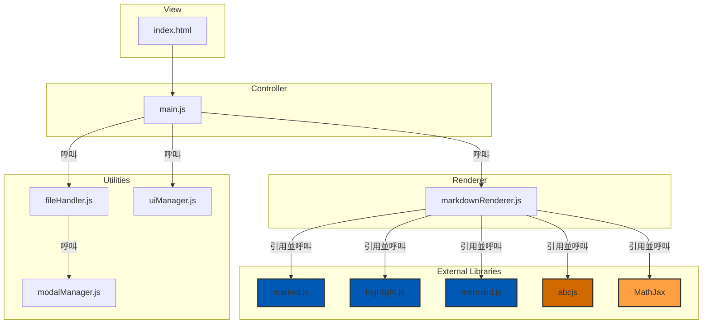
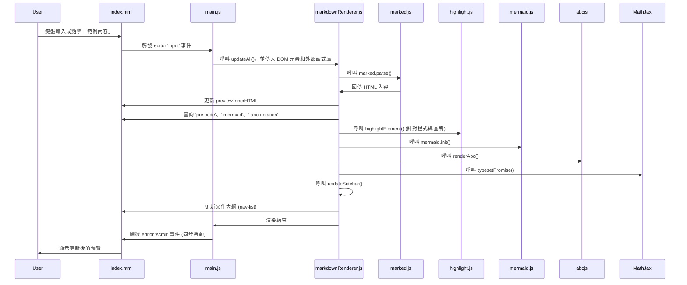
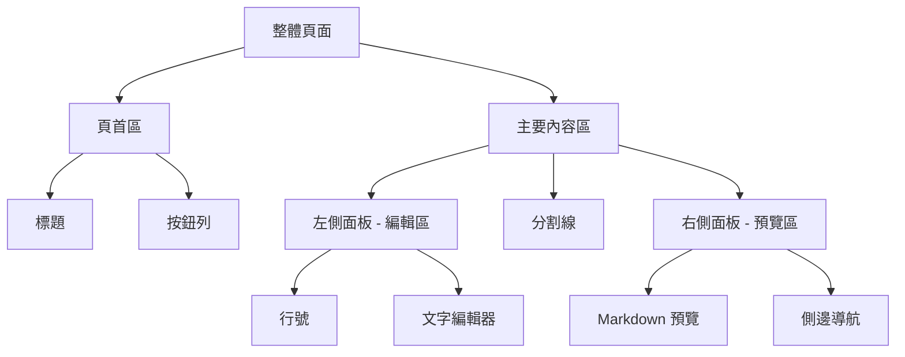
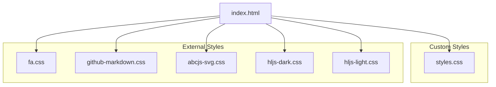
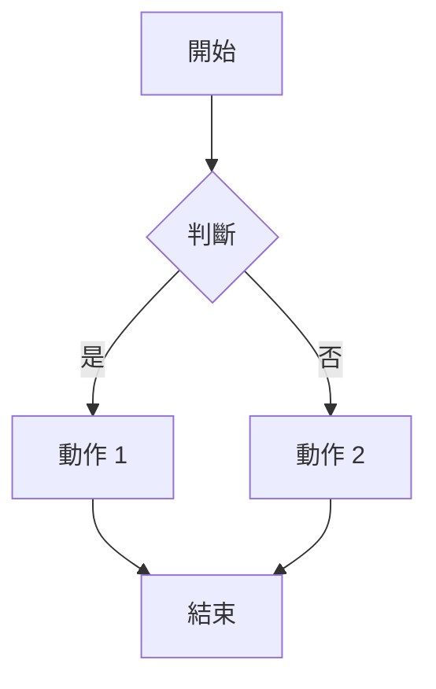
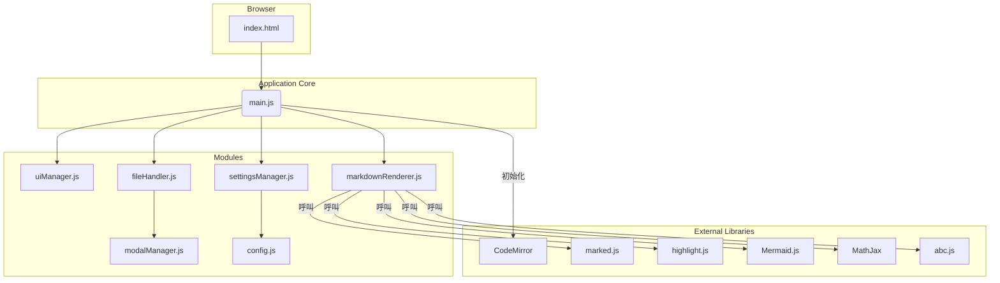
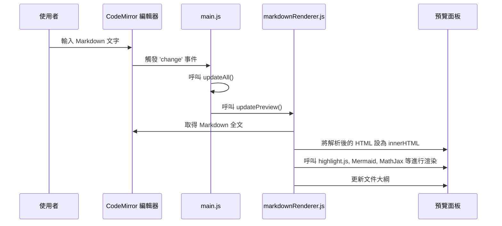
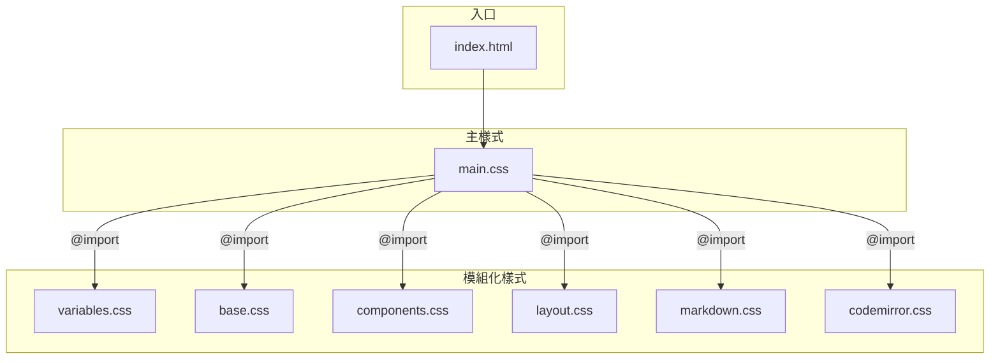
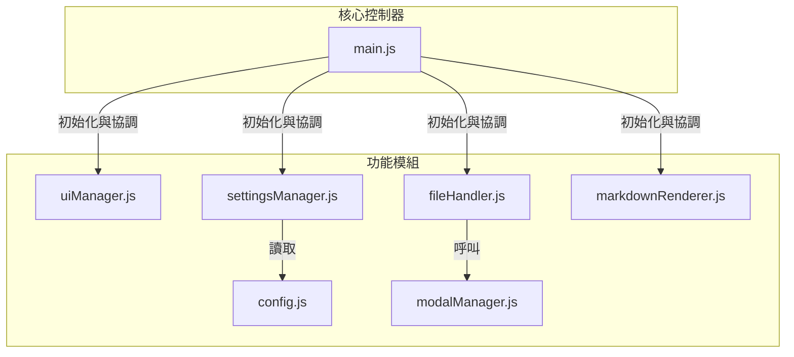

# Markdown 編輯器
## 歡迎使用這款強大的工具
這是一個支援多種進階功能的 Markdown 文件範例。
### 功能介紹
- **即時預覽**: 在右側面板即時顯示渲染結果。
- **程式碼**: 支援多種程式語言。
- **數學公式**: 支援 LaTeX 語法。
- **Mermaid 圖表**: 輕鬆繪製流程圖、序列圖等。
- **樂譜渲染**: 支援 ABC Notation 語法。
- **PDF 匯出**: 一鍵將內容轉換為 PDF。

### 程式碼範例
```javascript
function helloWorld() {
  console.log("Hello, World!");
}
```

### 數學公式
這是著名的質能等價公式： $E = mc^2$

其它數學式:
$$
\int_{0}^{\infty} e^{-x^2} dx = \frac{\sqrt{\pi}}{2}
$$
$$
\\int_{-\\infty}^\\infty e^{-x^2}dx = \\sqrt{\\pi}
$$

\\[
\\cos^2 \\theta + \\sin^2 \\theta = 1
\\]

<div style="page-break-after: always;"></div>
<br><br>

### Mermaid 圖表

 - 系統架構圖 (Architecture Diagram)



 - 循序圖 (Sequence Diagram)


<div style="page-break-after: always;"></div>
<br><br>

 - 版面配置規劃 (Layout Planning)


 - CSS 架構圖 (CSS Architecture Diagram)


<div style="page-break-after: always;"></div>
<br><br>


 - 流程圖範例 



<div style="page-break-after: always;"></div>
<br><br>

### 樂譜範例
```abc
X:1
T:愛爾蘭舞曲 (Drowsy Maggie) - 小調與裝飾音
M:4/4
L:1/8
K:Edor
E2BE dEBE|E2BE AFDF| E2BE dEBE|BABc dAFD:|
d2fd c2ec|defg afge|d2fd c2ec|BABc dAFD|
d2fd c2ec|defg afge|afge fdec|BABc dAFD||
```

```abc
X:1
T:和弦與歌詞範例
M:4/4
L:1/4
K:C
"Ｃ" C E G c | "Ｇ７" G B d f | "Ｆ" F A c' e' | "Ｃ" C E G c2 |
w: 歡-迎-來-到 | ABC-記-譜-法 | 世-界-真-奇-妙 | 音樂-真-美-妙-！
```

---

<div style="page-break-after: always;"></div>
<br><br>

# 專案架構文件

本文件旨在說明 Markdown 編輯器的整體架構、資料流程以及 CSS/JavaScript 的模組化設計。

## 1. 整體架構圖

此圖展示了專案的核心組成部分以及它們之間的依賴關係。



**說明**：

-   **`index.html`** 是應用的唯一入口點，負責載入所有必要的 CSS 和 JavaScript 資源。
-   **`main.js`** 是應用的核心控制器，負責初始化所有模組和函式庫，並綁定主要的事件監聽器。
-   **Modules** 是一組遵循「關注點分離」原則的 JavaScript 模組，每個模組都有明確的職責。
-   **External Libraries** 是專案所依賴的第三方函式庫，用於實現 Markdown 解析、語法高亮、圖表渲染等核心功能。

---

<div style="page-break-after: always;"></div>
<br><br>

## 2. 渲染流程循序圖

此圖詳細說明了從使用者在編輯器中輸入文字到預覽區更新的完整流程。



**說明**：

1.  使用者在 CodeMirror 編輯器中輸入內容。
2.  編輯器觸發 `change` 事件，通知 `main.js` 內容已變更。
3.  `main.js` 呼叫 `updateAll()` 函式，啟動渲染流程。
4.  `updateAll()` 內部呼叫 `markdownRenderer.js` 中的 `updatePreview()` 函式。
5.  `updatePreview()` 負責協調 `marked.js`、`highlight.js`、`Mermaid.js` 等函式庫，完成 Markdown 解析、語法高亮和圖表渲染。
6.  最終，將渲染完成的 HTML 內容更新到預覽面板中，並刷新文件大綱。

---

<div style="page-break-after: always;"></div>
<br><br>

## 3. CSS 架構

CSS 採用模組化和變數化的方式進行管理，以提高可維護性和主題切換的彈性。



**說明**：

-   **`main.css`** 是唯一的 CSS 入口，負責匯入所有其他樣式檔案。
-   **`variables.css`**：定義了所有顏色、字體等全域 CSS 變數，是實現主題切換的核心。
-   **`base.css`**：設定全域和基礎 HTML 元素的樣式。
-   **`components.css`**：定義可重用的 UI 元件，如按鈕、模態框。
-   **`layout.css`**：負責頁面的宏觀佈局，如分割面板。
-   **`markdown.css`**：專門定義預覽區中 Markdown 內容的樣式。
-   **`codemirror.css`**：專門定義 CodeMirror 編輯器的樣式及主題覆寫。

---

<div style="page-break-after: always;"></div>
<br><br>

## 4. JavaScript 架構

JavaScript 同樣採用模組化設計，每個模組職責分明，透過 `main.js` 進行協調。



**說明**：

-   **`main.js`**：核心控制器。職責：初始化、綁定核心事件、協調各模組。
-   **`config.js`**：靜態設定檔。職責：存放不會改變的設定，如顏色對應表。
-   **`uiManager.js`**：UI 管理器。職責：處理純粹的 UI 互動，如主題切換、檢視模式、標頭收合。
-   **`fileHandler.js`**：檔案處理器。職責：處理檔案的上傳、下載、匯出 PDF 等。
-   **`settingsManager.js`**：設定管理器。職責：處理設定面板的所有邏輯，包括儲存、讀取和應用設定。
-   **`markdownRenderer.js`**：渲染器。職責：協調 `marked.js` 和其他函式庫，將 Markdown 文本轉換為最終的預覽內容。
-   **`modalManager.js`**：模態框管理器。職責：提供一個統一的 API 來顯示各類型的對話框。

