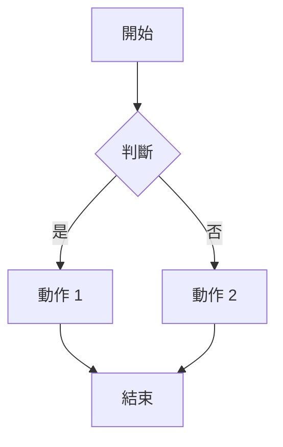

# 專業 Markdown 編輯器
## 歡迎使用這款強大的工具
這是一個支援多種進階功能的 Markdown 文件範例。
### 功能介紹
- **即時預覽**: 在右側面板即時顯示渲染結果。
- **程式碼**: 支援多種程式語言。
- **數學公式**: 支援 LaTeX 語法。
- **Mermaid 圖表**: 輕鬆繪製流程圖、序列圖等。
- **樂譜渲染**: 支援 ABC Notation 語法。
- **PDF 匯出**: 一鍵將內容轉換為 PDF。

### 程式碼範例
```javascript
function helloWorld() {
  console.log("Hello, World!");
}
```

### 數學公式
行內公式: $E = mc^2$

區塊公式:
$$
\int_{0}^{\infty} e^{-x^2} dx = \frac{\sqrt{\pi}}{2}
$$

### Mermaid 圖表


### 樂譜範例
```abc
X:1
T:聖誕快樂歌 (Jingle Bells)
M:4/4
L:1/8
K:G
V:1
G2G2 G2G2 | G2D2 B4 | A2A2 A2A2 | A2E2 D2C2 |
```

希望您喜歡！